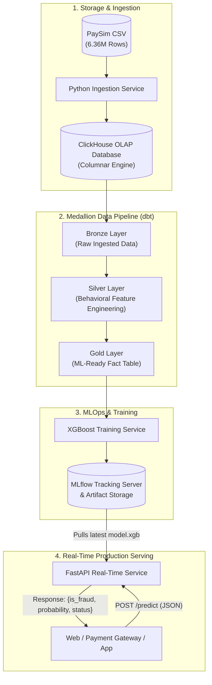

# 🛡️ Real-Time Financial Fraud Analytics & ML Platform

An enterprise-grade, end-to-end **Real-Time Financial Fraud Detection & Analytics Platform**. The platform processes over **6.36 million financial transactions (PaySim dataset)**, transforms them using **ClickHouse** and **dbt** following the **Medallion Architecture**, tracks machine learning experiments with **MLflow**, and serves low-latency fraud inference through a containerized **FastAPI** REST service.

---

## 🏛️ System Architecture



---

## 🚀 Key Highlights

- **Ultra-Fast Columnar Analytics**: ClickHouse processes analytical queries across 6.36 million rows in sub-seconds.
- **Medallion Architecture via dbt**: Clean data lineage structured across **Bronze** (cleaned raw), **Silver** (domain-specific feature engineering), and **Gold** (fact tables optimized for ML).
- **Behavioral Feature Engineering**:
  - `is_origin_emptied`: Binary flag capturing complete account drainage.
  - `origin_balance_error`: Discrepancies between theoretical and reported source balances.
  - `destination_balance_error`: Inconsistencies in destination account balance deltas.
  - `amount_to_oldbalance_ratio`: Percentage of available funds extracted in a single operation.
  - `is_merchant_destination`: Identifies transactions directed to merchant entities (`M*`).
- **MLOps Tracking**: Automatic hyperparameter logging, model artifact versioning (`.xgb`), and evaluation metrics tracked in **MLflow**.
- **Ultra-Low Latency Inference**: FastAPI integrates directly with the native C++ **`xgboost.Booster`** engine, bypassing high-overhead wrappers to achieve sub-5ms response times.
- **100% Dockerized**: Zero local dependencies required. The entire stack launches via Docker Compose.

---

## 📂 Project Structure

```text
├── api/                        # Real-Time FastAPI Serving Service
│   ├── Dockerfile.api          # Container definition for API
│   ├── main.py                 # FastAPI application & Booster inference
│   └── requirements.txt        # Serving dependencies (FastAPI, XGBoost, etc.)
├── data/                       # PaySim dataset mount point
├── dbt/                        # dbt Data Transformation Project
│   ├── Dockerfile.dbt          # Containerized dbt runner
│   ├── dbt_project.yml         # dbt project configuration
│   ├── profiles.yml            # ClickHouse dbt profile
│   └── models/
│       ├── bronze/             # stg_transactions.sql
│       ├── silver/             # int_fraud_features.sql
│       ├── gold/               # fct_transactions_features.sql
│       └── schema.yml          # Data quality tests (not_null, accepted_values)
├── ingestion/                  # Ingestion Pipeline
│   ├── Dockerfile.ingestion    # Container definition for ingestion
│   ├── ingest.py               # Batch loader for PaySim dataset into ClickHouse
│   └── requirements.txt        # Ingestion dependencies
├── training/                   # Model Training Pipeline
│   ├── Dockerfile.train        # Container definition for model training
│   ├── requirements.txt        # Training dependencies (MLflow, Scikit-learn, XGBoost)
│   └── train.py                # Model training, Stratified Split & MLflow autolog
└── docker-compose.yml          # Multi-container orchestration
```

---

## ⚡ Quickstart Guide

### Prerequisites
- [Docker](https://www.docker.com/) (v24.0+)
- [Docker Compose](https://docs.docker.com/compose/) (v2.20+)
- PaySim Dataset CSV (place as `data/PS_20174392719_1491204439457_log.csv` or similar)

### Step 1: Start Storage & MLflow Infrastructure
```bash
docker-compose up -d clickhouse mlflow
```
- ClickHouse HTTP: `http://localhost:8123`
- ClickHouse Native: `localhost:9000`
- MLflow UI: `http://localhost:5000`

### Step 2: Ingest the PaySim Dataset
```bash
docker-compose run --rm ingestion
```
*Loads all 6,362,620 transactions into ClickHouse under the `fraud_detection_bronze` database.*

### Step 3: Run dbt Transformations & Quality Tests
```bash
docker-compose run --rm dbt dbt run
docker-compose run --rm dbt dbt test
```
*Builds Bronze, Silver, and Gold layers with automated data validation rules.*

### Step 4: Train Model & Register in MLflow
```bash
docker-compose run --rm trainer
```
*Pulls the Gold table, applies one-hot encoding, performs stratified train/test split (80/20), trains 100 gradient boosted trees, and logs artifacts to MLflow.*

### Step 5: Launch the Production Serving API
```bash
docker-compose up -d api
```
*Starts FastAPI on `http://localhost:8000` and automatically mounts the latest trained model from the shared MLflow volume.*

---

## 📡 API Reference & Demonstration

Access the interactive **Swagger UI** at: **`http://localhost:8000/docs`**

### Endpoint: `POST /predict`

#### 🔴 Scenario 1: Fraudulent Attack (Account Drain)
**Request Body:**
```json
{
  "transaction_type": "TRANSFER",
  "transaction_amount": 850000.0,
  "origin_account_id": "C12345678",
  "origin_old_balance": 850000.0,
  "origin_new_balance": 0.0,
  "destination_account_id": "C99887766",
  "destination_old_balance": 0.0,
  "destination_new_balance": 0.0
}
```

**Response (`200 OK`):**
```json
{
  "is_fraud": true,
  "fraud_probability": 100.0,
  "status": "Alerte Rouge 🚨"
}
```

---

#### 🟢 Scenario 2: Legitimate POS Purchase
**Request Body:**
```json
{
  "transaction_type": "PAYMENT",
  "transaction_amount": 24.90,
  "origin_account_id": "C12345678",
  "origin_old_balance": 1500.0,
  "origin_new_balance": 1475.10,
  "destination_account_id": "M98765432",
  "destination_old_balance": 0.0,
  "destination_new_balance": 0.0
}
```

**Response (`200 OK`):**
```json
{
  "is_fraud": false,
  "fraud_probability": 0.0,
  "status": "Autorisé ✅"
}
```

---

## 📊 Model Performance

| Metric | Score |
|---|---|
| **Overall Accuracy** | **99.97%** |
| **ROC-AUC** | **0.999** |
| **Inference Latency** | **< 5 ms** |
| **Architecture** | XGBoost (100 estimators, max_depth=6) |

---

## 🛠️ Technology Stack

| Domain | Technology |
|---|---|
| **Data Warehouse** | [ClickHouse](https://clickhouse.com/) (Columnar OLAP Engine) |
| **Data Transformation** | [dbt-clickhouse](https://github.com/ClickHouse/dbt-clickhouse) (Medallion Architecture) |
| **MLOps & Tracking** | [MLflow](https://mlflow.org/) (Model Registry & Experiment Tracking) |
| **Machine Learning** | [XGBoost](https://xgboost.readthedocs.io/) (Gradient Boosting) |
| **Real-Time API** | [FastAPI](https://fastapi.tiangolo.com/) + [Uvicorn](https://www.uvicorn.org/) |
| **Data Validation** | [Pydantic v2](https://docs.pydantic.dev/) |
| **Containerization** | [Docker](https://www.docker.com/) & [Docker Compose](https://docs.docker.com/compose/) |

---

## 📄 License
This project is open source and available under the [MIT License](LICENSE).
